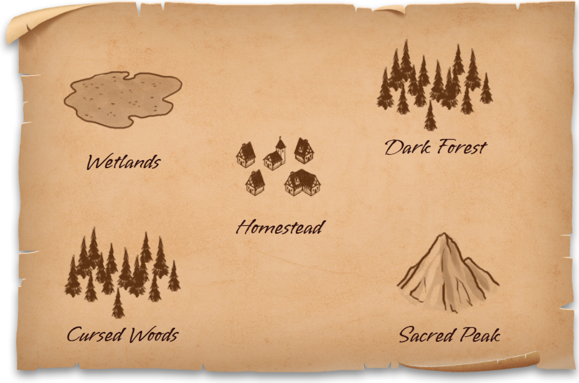
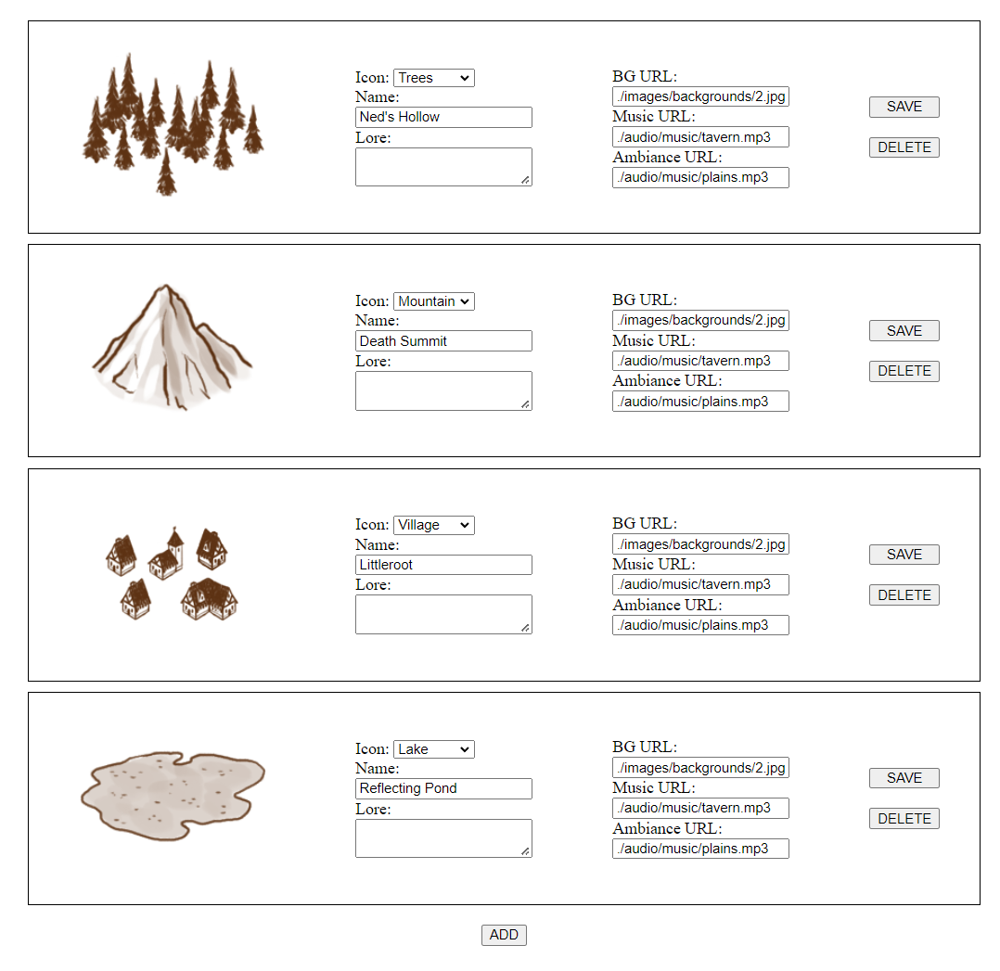

# Map Builder
Map Builder is a web application that allows users to build maps with customized locations. Currently users can add nodes, rename, and move them. MB is built with JS, HTML, CSS, and JQuery.

## Features

* Ability to add new node editors
* Ability to change node icons and name and have those updated on the map
* Ability to move nodes on the map

## Attribution
* Audio: https://tabletopaudio.com/
* Map Assets: https://opengameart.org/content/simple-map-tiles
* Backgrounds: https://unsplash.com/

## Images

